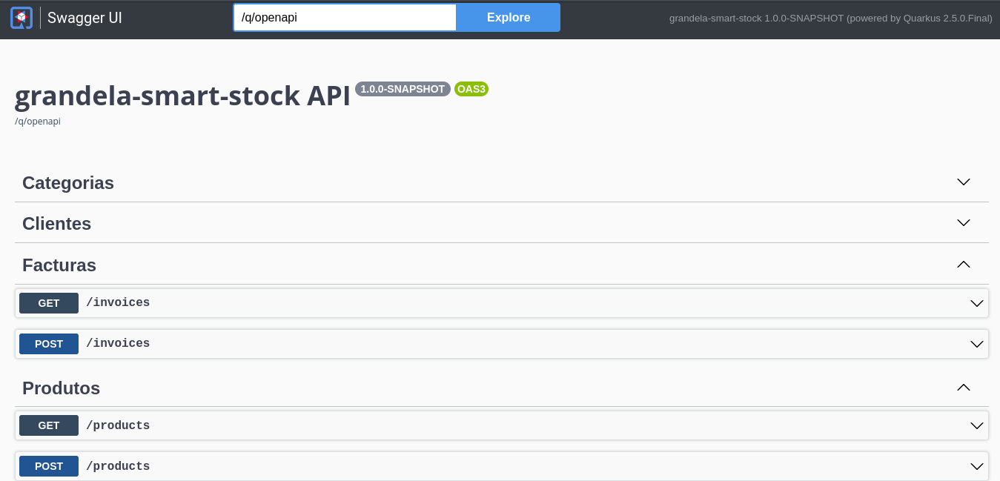

# Smart-stock

Este projecto foi desenvolvido usando **[Quarkus](https://quarkus.io/)**, um Java Framework Supersonic e Subatomic como esta definido no site dele.

## Sobre

**smart-stock** é uma **REST API** desenvolvida com quarkus with usando a linguafem **kotlin** e outras tecnologia em volta do **Java EE** e **MicroProfile** como :

- JPA e Hibernate
- OPEN-API e SWAGGER
- CDI e JAX-RS
- JDBC - POSTGRES e BEAV VALIDATION

### Outros

- DOCKER
- DOCKER-COMPOSE
- POSTGRESQL
- KOTLIN

## Requisitos Para rodar a aplicação

- JAVA 11
- DOCKE e DOCKER COMPOSE
- MAVEN 3.8.1

## Como Rodar a Aplicação

## 1ª

Clone o repositório com o camando abaixo **tens de ter o git instalado na sua maquina**

```shell script
git clone https://github.com/fmanuel98/gradela-smart-api

```

## 2º

Depois mude de diretório usando o comando abaixo

```shell script
cd gradela-smart-api

```

## 3º

por ultimo rode a aplicação usando o comando a baixo

```shell script
docker-compose up -d && mvn compile quarkus:dev
```

### Para ver o APP rodando

4º Abra o seu browser e acessa as urls abaixo

> **_NOTE:_** essa url dará acesso a Dev UI, Que esta disponivel em dev Mode http://localhost:8080/q/dev/.

> **Link do Swagger-UI** http://localhost:8080/q/swagger-ui/

## Finalmente

Se tudo deu certo devera aparecer uma imagem semelhante a que esta abaixo

Ou podes ver na tudo na **[Heroku](https://gradela-smart-stock.herokuapp.com/q/swagger-ui/)**


